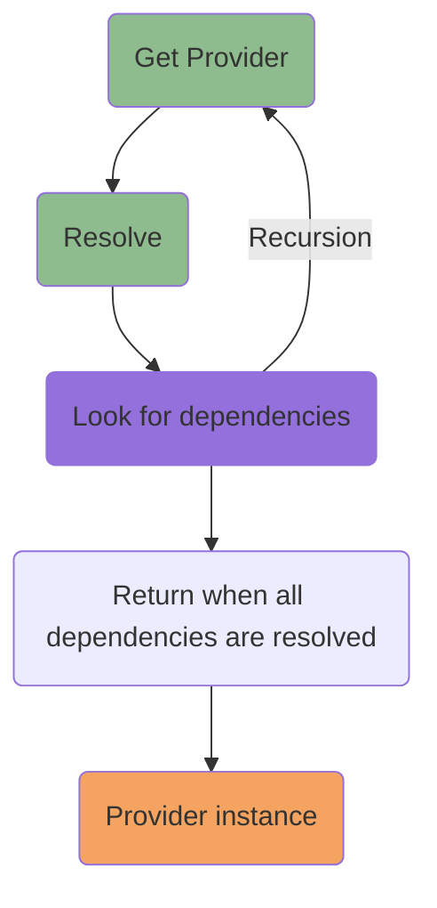

# Container

The container is that component where providers declarations are registered in order to be resolved in a second time 
whenever its injection are requested.

## Register

```typescript
import { Container, Injectable } from '@pequehq/di';

@Injectable()
class Foo {
  getPizza() {
    return 'pizza';
  }
}

const DI = new Container();

DI.set(Foo, 'Foo');
```

### Implicit set

You can also register the providers directly within the `Container` constructor.

```typescript
import { Container, Injectable } from '@pequehq/di';

@Injectable()
class Foo {
  getPizza() {
    return 'pizza';
  }
}

const DI = new Container({ providers: [Foo] });
```

### Binding

Normally, the binding of the register is implicit, which means it is the provider itself (self), but in the case you
want to perform an inversion of control of a provider in favor of another, you can specify an explicit binding in order
to tell the container to resolve the initial provider with the bound one.

```typescript
import { Container, Injectable } from '@pequehq/di';

@Injectable()
class Provider {
  test() {
    return 'pizza';
  }
}

@Injectable()
class NewProvider {
  test() {
    return 'hotdog';
  }
}

const DI = new Container();

// Register with explicit binding.
DI.set(Provider, 'Provider').to(NewProvider);
DI.set(NewProvider, 'NewProvider');

// Resolve.
DI.get('Provider').test(); // prints "hotdog";
```

### Scope

There are two possible scopes within the container:
- Singleton
- Non-Singleton

| Scope             | Description                                                                                                                                   |
|-------------------|-----------------------------------------------------------------------------------------------------------------------------------------------|
| `default`         | The dependency is a `singleton` and it will be resolved as so without any setting while registering a dependency or injecting via `@Inject()` |
| `non-singleton`   | The dependency will be resolved as a brand new instance                                                                                       |

### Register

```typescript
import { Container, Injectable } from '@pequehq/di';

@Injectable()
class Foo {
  test() {
    return 'pizza';
  }
}

const DI = new Container();

DI.set(Foo, 'Foo').nonSingleton();

// Resolve.
DI.get('Foo').test(); // brand new instance;
```

### Inject decorator

```typescript
import { Container, Injectable } from '@pequehq/di';

@Injectable()
class Foo {
  test() {
    return 'pizza';
  }
}

@Injectable()
class Baz {
  test() {
    return 'sushi';
  }
}

@Injectable()
class Bar {
  @Inject('Baz', { scope: 'non-singleton' })
  baz: Baz;
  
  constructor(@Inject('Bar', { scope: 'non-singleton' }) public foo: Foo) {}
  
  test() {
    return 'hotdog';
  }
}

const DI = new Container();

DI.set(Foo, 'Foo');
DI.set(Bar, 'Bar');


// Resolve.
DI.get('Bar').foo.test(); // brand new instance;
DI.get('Bar').baz.test(); // brand new instance;
```

## Resolve

The resolve process takes care of resolving and injecting all the dependencies for the requested providers in order to
finally deliver a working instance of it.



```typescript
import { Container, Injectable } from '@pequehq/di';

@Injectable()
class Foo {
  getPizza() {
    return 'pizza';
  }
}

@Injectable()
class Bar {
  constructor(private foo: Foo) {}

  test() {
    console.log(this.foo.getPizza())
  }
}

// Implicit register.
const DI = new Container({ providers: [Foo, Bar] });

// Resolve.
DI.get<Bar>('Bar').test(); // prints "pizza".
```

## Unset

It can also be possible to unset providers from the container.

```typescript
import { Container, Injectable } from '@pequehq/di';

@Injectable()
class Foo {
  getPizza() {
    return 'pizza';
  }
}

// Implicit register.
const DI = new Container({ providers: [Foo] });

// Resolve.
DI.get<Foo>('Foo').test(); // prints "pizza".

// Unset.
DI.unset('Foo').test(); // prints "pizza".
```

## Events

Within the Container, you can intercept the init and the destroy events of the providers by defining specific callbacks
inside the constructor options of the container itself.

```typescript
import { Container, Injectable } from '@pequehq/di';

@Injectable()
class Provider {
  test() {
    return 'pizza';
  }
}

const DI = new Container({ 
  onInit: (name: string, instance: ProviderInstance): void => console.log(name),
  onDestroy: (name: string, instance: ProviderInstance): void => console.log(name),
});

// Register.
DI.set(Provider, 'Provider');

// Resolve.
DI.get('Provider').test(); // prints "hotdog" and triggers the onInit event.

// Unset.
DI.unset('Provider'); // it will trigger the onDestroy event.
```
