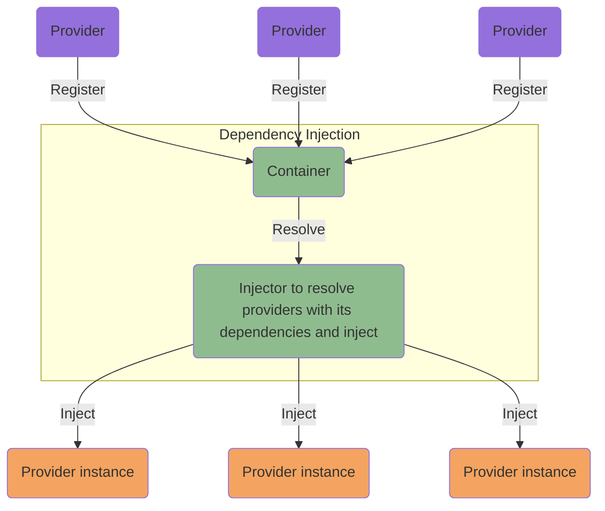

# Dependency injection

It is one of the techniques of the inversion of control, and the purpose is to relieve a service from the responsibility
of having to know how to construct itself. Instead, the service shall delegate this responsibility to an external
service (injector) which will construct it with the necessary dependencies.

The [dependency injection](https://en.wikipedia.org/wiki/Dependency_injection), hence, helps with implementing the 
[separation of concerns](https://en.wikipedia.org/wiki/Separation_of_concerns) design principle.

