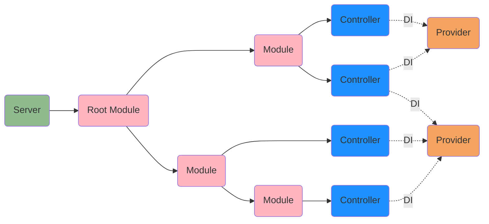

# General architecture

```mermaid
graph LR
  linkStyle default interpolate basis
  
  S(Server):::server --> RM(Root Module):::module
  RM --> M1(Module):::module
  RM --> M2(Module):::module
  M1 --> C1(Controller):::controller
  M1 --> C2(Controller):::controller
  M2 --> M3(Module):::module
  M2 --> C3(Controller):::controller
  M3 --> C4(Controller):::controller
  C1 -.DI.-> P1(Provider):::service
  C2 -.DI.-> P1
  C2 -.DI.-> P2(Provider):::service
  C3 -.DI.-> P2
  C4 -.DI.-> P2
  
  classDef server fill:DarkSeaGreen
  classDef module fill:LightPink
  classDef controller fill:DodgerBlue
  classDef service fill:SandyBrown
```
