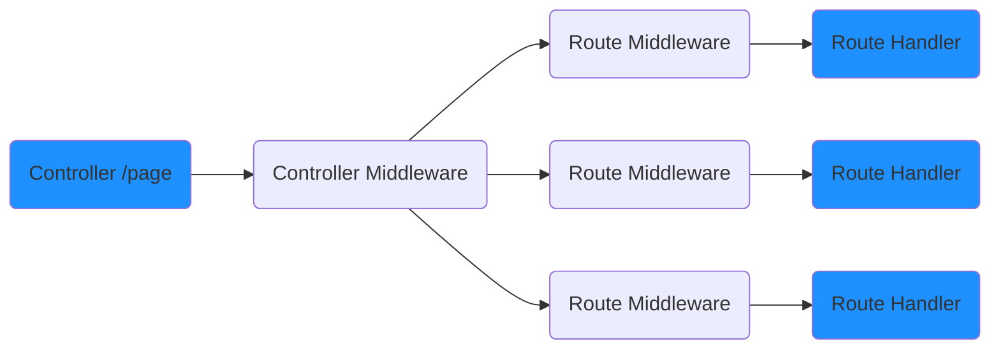

# Middlewares

Middlewares are providers classes decorated with the `@Middleware()` decorator.
The class, though, must implement the `MiddlewareHandler` interface.

```typescript
@Middleware()
export class TestMiddleware implements MiddlewareHandler {
  handler(req: Request, res: Response, next: NextFunction): void {
    // Logic.
    next();
  }
}
```



The middlewares can be placed both at **Controller** and **Route** time by using the `@UseMiddleware()` decorator.

```typescript
@UseMiddleware(TestMiddleware)
@Controller('/test')
class TestMiddlewareController {
  
  @UseMiddleware(TestMiddleware)
  @Get('/test-method')
  testMethod() {
    // Logic.
  }
}
```
