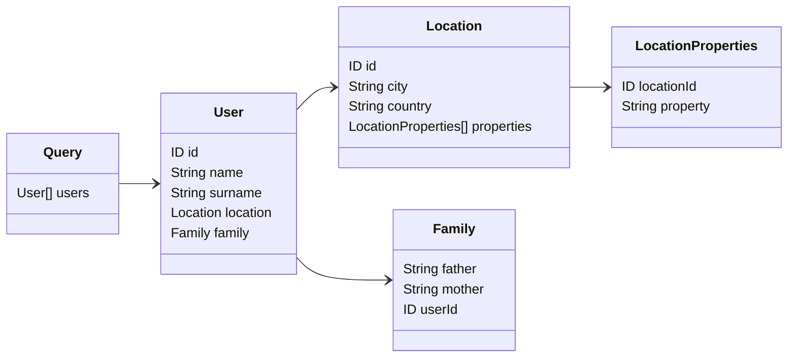
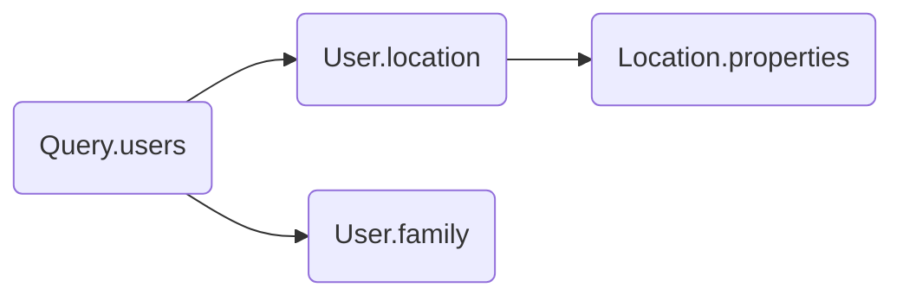

# Fields

The fields that a query shall resolve should be represented as class methods decorated with `@Field()`.

## Options

The `@Field()` decorator supports parameters defined by the `IFieldOptions` interface.

| Options  | Description                                                                                             | Required |
|----------|---------------------------------------------------------------------------------------------------------|----------|
| `name`   | The name of the field in the SDL schema. If not specified, the name is assumed to be the method's name. | No       |
| `type`   | The belonging SDL schema type of the field.                                                             | Yes      |

## Usage example



```typescript
import { Resolver, Query, Field, Parent } from '@pequehq/graphql';
import { UserService, FamilyService, LocationService, LocationPropertyService } from '../your/services';
import { User, Location, LocationProperty, Family } from '../your/dto'

@Resolver()
class ExampleResolver {
  constructor(private userService: UserService,
              private familyService: FamilyService,
              private locationService: LocationService,
              private locationPropertyService: LocationPropertyService) {}
  
  @Query()
  async users(): Promise<User[]> {
    return this.userService.getAll();
  }

  @Field({ type: User })
  async location(@Parent() parent: User): Promise<Location> {
    return this.locationService.get(parent.location);
  }

  @Field({ type: User })
  async family(@Parent() parent: User): Promise<Family> {
    return this.familyService.get(parent.family);
  }

  @Field({ type: Location, name: 'properties' })
  async properties(@Parent() parent: Location): Promise<LocationProperty[]> {
    return this.locationPropertyService.get(parent.id);
  }
}
```

## Graph representation

The above class is indeed representing the resolver graph that will be executed to resolve data for a specified query.


