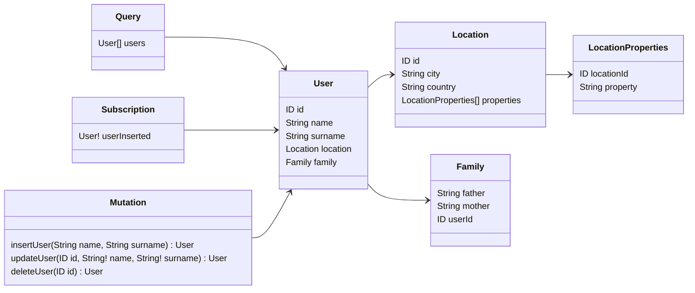

# Full example



```typescript
import { Resolver, Query, Mutation, Subscription, Field, Parent } from '@pequehq/graphql';
import { Injectable } from '@pequehq/di';
import {
  UserService,
  FamilyService,
  LocationService,
  LocationPropertyService,
  PubSubService,
} from '../your/services';
import { User, Location, LocationProperty, Family } from '../your/dto'

@Injectable()
@Resolver()
class ResolverSchemaOne {
  constructor(private userService: UserService,
              private familyService: FamilyService,
              private locationService: LocationService,
              private locationPropertyService: LocationPropertyService,
              private pubSub: PubSubService) {}
  
  @Query()
  async users(): Promise<User[]> {
    return await this.userService().getAll();
  }

  @Field({ type: User })
  async location(@Parent() parent: User): Promise<Location> {
    return await this.locationService.get(parent.location);
  }

  @Field({ type: User })
  async family(@Parent() parent: User): Promise<Family> {
    return await this.familyService.get(parent.family);
  }

  @Field({ type: Location, name: 'properties' })
  async properties(@Parent() parent: Location): Promise<LocationProperty[]> {
    return await this.locationPropertyService.get(parent.id);
  }

  @Mutation()
  async insertUser(@Args() args: any): Promise<User> {
    return await this.userService.insert({ name: args.name, surname: args.surname });
  }

  @Mutation()
  async updateUser(@Args() args: any): Promise<User> {
    return await this.userService.update(args.id, { name: args.name, surname: args.surname });
  }

  @Mutation()
  async updateUser(@Args() args: any): Promise<User> {
    const user = await this.userService.get(args.id);
    await this.userService.delete(args.id);

    return user;
  }

  @Subscription()
  userInserted(): User {
    return this.pubSub.asyncIterator('userInserted');
  }
}
```
