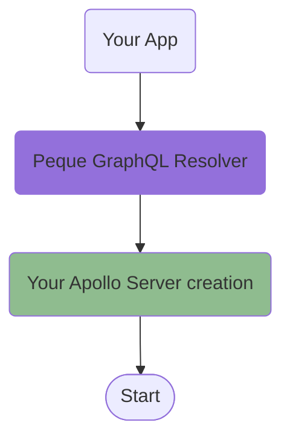

# Peque GraphQL

This library is built on top of [Apollo Server](https://www.apollographql.com/docs/apollo-server/), and it allows you to
code your resolvers following an [OOP](https://en.wikipedia.org/wiki/Object-oriented_programming)/[AOP](https://en.wikipedia.org/wiki/Aspect-oriented_programming) flavor to better fit enterprise-level paradigms and patterns.



## Install

```bash
npm install @pequehq/graphql reflect-metadata
```

**Note**: tsconfig's `compilerOptions` in your project must have both `experimentalDecorators`
and `emitDecoratorMetadata` set to **true**.

## Usage

Check the next section [Resolvers](/docs/graphql/resolvers) for information on how to use this library.
