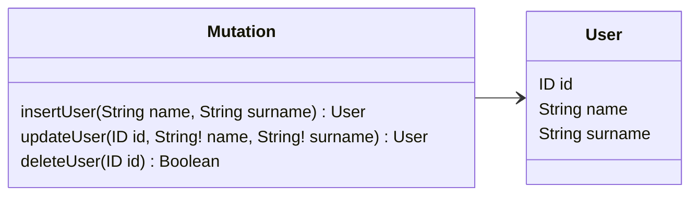

# Mutations

Mutations are the conventional SDL schema type designated to represent a data modification query. They should be 
defined as class methods decorated with `@Mutation()`.

## Options

The `@Mutation()` decorator supports parameters defined by the `IMutationOptions` interface.

| Options  | Description                                                                                                                    | Required |
|----------|--------------------------------------------------------------------------------------------------------------------------------|----------|
| `name`   | The name of the mutation query in the SDL schema mutation type. If not specified, the name is assumed to be the method's name. | No       |

## Usage example



```typescript
import { Resolver, Mutation, Args } from '@pequehq/graphql';
import { UserService } from '../your/services';
import { User } from '../your/dto'

@Resolver()
class ExampleResolver {
  constructor(private userService: UserService) {}

  @Mutation()
  async insertUser(@Args() args: Partial<User>): Promise<User> {
    return this.userService.insert({ name: args.name, surname: args.surname });
  }

  @Mutation()
  async updateUser(@Args() args: Partial<User>): Promise<User> {
    return this.userService.update(args.id, { name: args.name, surname: args.surname });
  }

  @Mutation()
  async deleteUser(@Args() args: { id: string }): Promise<boolean> {
    return this.userService.delete(args.id);
  }
}
```
