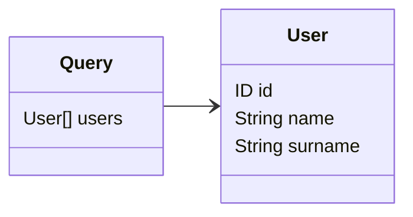

# Queries

Queries are the entry point of a GraphQL operation. Resolvers will resolve one query at a time, and `@Query()`
shall decorate the class method that contains the query resolver logic.

## Options

The `@Query()` decorator supports parameters defined by the `IQueryOptions` interface.

| Options  | Description                                                                                                        | Required |
|----------|--------------------------------------------------------------------------------------------------------------------|----------|
| `name`   | The name of the query in the SDL schema query type. If not specified, the name is assumed to be the method's name. | No       |

## Usage example



```typescript
import { Resolver, Query } from '@pequehq/graphql';
import { User } from '../your/dto'

@Resolver()
class ExampleResolver {
  @Query()
  async users(): Promise<User[]> {
    return Promise.resolve([
      { id: '1', name: 'Keanu', surname: 'Reeves' },
      { id: '2', name: 'James', surname: 'Bond' },
    ]);
  }
}
```
