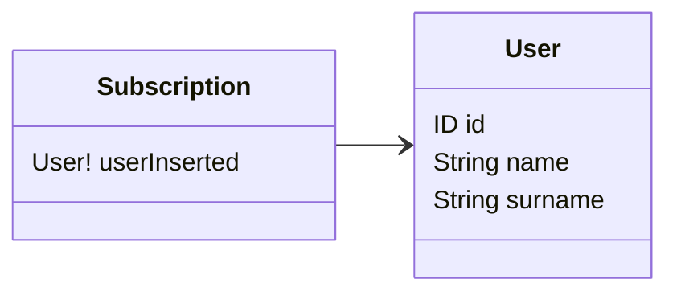

# Subscriptions

Subscriptions are fields which use a different paradigm to resolve compared to the queries. Instead of getting a one
time result, the subscription will ask the server to subscribe to real-time data (like streaming), and the client will
receive data as soon as new data is made available by the subscription resolver.

Subscriptions are methods of a Resolver class decorated with `@Subscription()`.

## Options

The `@Subscription()` decorator supports parameters defined by the `ISubscriptionOptions` interface.

| Options | Description                                                                                                                      | Required |
|---------|----------------------------------------------------------------------------------------------------------------------------------|----------|
| `name`  | The name of the subscription in the SDL schema subscription type. If not specified, the name is assumed to be the method's name. | No       |

## Example usage



```typescript
import { Resolver, Subscription } from '@pequehq/graphql';
import { PubSubService } from '../your/services';
import { User } from '../your/dto'

@Resolver()
class ExampleResolver {
  constructor(private pubSub: PubSubService) {}

  @Subscription()
  userInserted(): User {
    return this.pubSub.asyncIterator('userInserted');
  }
}
```

## Pub Sub

The `PubSub` pattern is well explained in Apollo [documentation](https://www.apollographql.com/docs/graphql-subscriptions/setup/).

Please note that the basic `PubSub` implementation provided by the lib [graphql-subscriptions](https://github.com/apollographql/graphql-subscriptions)
is not suitable for production environments because it only supports a single server (in-memory), and it should be
replaced by one of the available `PubSub` subclasses.
Read more [here](https://www.apollographql.com/docs/apollo-server/data/subscriptions/#the-pubsub-class). 
