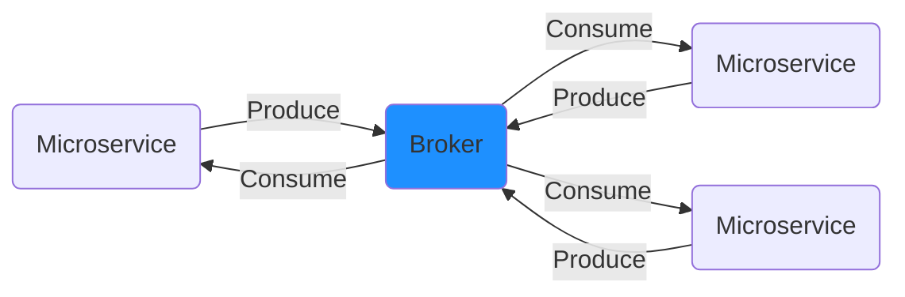

# Peque SMB (Simple Message Broker)

Peque SMB is a TCP-based Pub/Sub non-persistent type of message broker. It allows clients to subscribe topics
specifically and via RegEx patterns as well and to send messages against specific topics. The broker, though, does not
allow the broadcast of messages to all the client, but only to those clients that have made a subscription to the topics
(or the RegEx patter) that have received a message.

In software engineering, message brokers are most likely used for software decoupling, as in the microservice architecture,
where microservices produces and consumes events.

