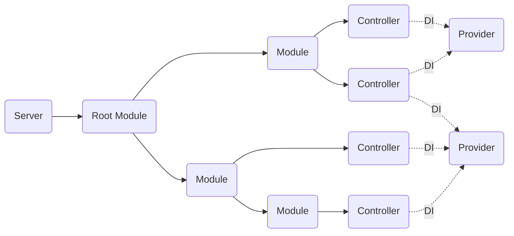

# General architecture

```mermaid
graph LR
  linkStyle default interpolate basis
  
  S(Server) --> RM(Root Module)
  RM --> M1(Module)
  RM --> M2(Module)
  M1 --> C1(Controller)
  M1 --> C2(Controller)
  M2 --> M3(Module)
  M2 --> C3(Controller)
  M3 --> C4(Controller)
  C1 -.DI.-> P1(Provider)
  C2 -.DI.-> P1
  C2 -.DI.-> P2(Provider)
  C3 -.DI.-> P2
  C4 -.DI.-> P2
```
