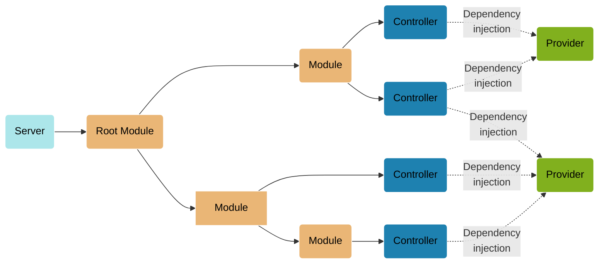

# General architecture

```mermaid
graph LR
    linkStyle default interpolate basis
    
    S(Server) --> RM(Root Module)
    RM --> M1(Module)
    RM --> M2[Module]
    M1 --> C1(Controller)
    M1 --> C2(Controller)
    M2 --> M3(Module)
    M2 --> C3(Controller)
    M3 --> C4(Controller)
    C1 -.Dependency<br>injection.-> P1(Provider)
    C2 -.Dependency<br>injection.-> P1
    C2 -.Dependency<br>injection.-> P2(Provider)
    C3 -.Dependency<br>injection.-> P2
    C4 -.Dependency<br>injection.-> P2

    style S fill:#ace6ea,color:#000,stroke:#fff,stroke-width:1px
    style RM fill:#eab676,color:#000,stroke:#fff,stroke-width:1px
    style M1 fill:#eab676,color:#000,stroke:#fff,stroke-width:1px
    style M2 fill:#eab676,color:#000,stroke:#fff,stroke-width:1px
    style M3 fill:#eab676,color:#000,stroke:#fff,stroke-width:1px
    style C1 fill:#1e81b0,color:#000,stroke:#fff,stroke-width:1px
    style C2 fill:#1e81b0,color:#000,stroke:#fff,stroke-width:1px
    style C3 fill:#1e81b0,color:#000,stroke:#fff,stroke-width:1px
    style C4 fill:#1e81b0,color:#000,stroke:#fff,stroke-width:1px
    style P1 fill:#81b01e,color:#000,stroke:#fff,stroke-width:1px
    style P2 fill:#81b01e,color:#000,stroke:#fff,stroke-width:1px
```
