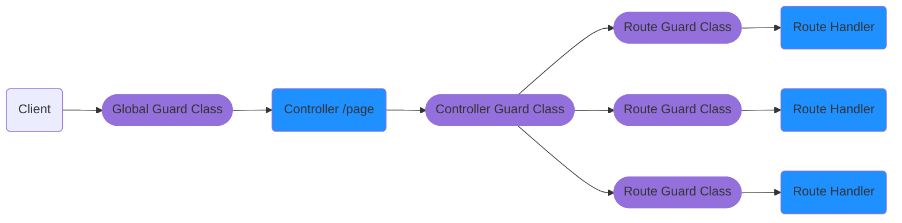

# Guards

The guards are injectable classes that shall implement the `CanExecute` interface.
Guards contain the logic and the context which will decide if a request will be handled or not.

Typical use cases can be JWT validation, user roles, permission, and like.



```typescript
@Injectable()
export class TestGuard implements CanExecute {
  async canExecute(context: RequestContext): Promise<boolean> {
    return await validateRequest(context);
  }
}
```

Once created, the guards can be applied at Controller level, Route level, by using the `@Guard()` decorator.

```typescript
@Guard(TestControllerGuard)
@Controller('/test')
export class TestController {
  constructor(private readonly loggerService: LoggerService) {
  }
  
  @Guard(TestRouteGuard)
  @Get('/hello-world')
  async helloWorld() {
    this.loggerService.log({level: 'info', data: 'Test log from /hello-world'});
    return { test: 'hello world' };
  }
}
```

Guards can be also globals via the `Server` configuration.

```typescript
async function startUp() {
  await PequeFactory.createServer({
    rootModule: TestRootModule,
    guards: [TestServerGuard]
  }).start();
}

startUp();
```

When the guard is not allowing the route, it will return an `HTTP 403` error with the following payload.

```json
{
  "message": "Forbidden resource"
}
```
