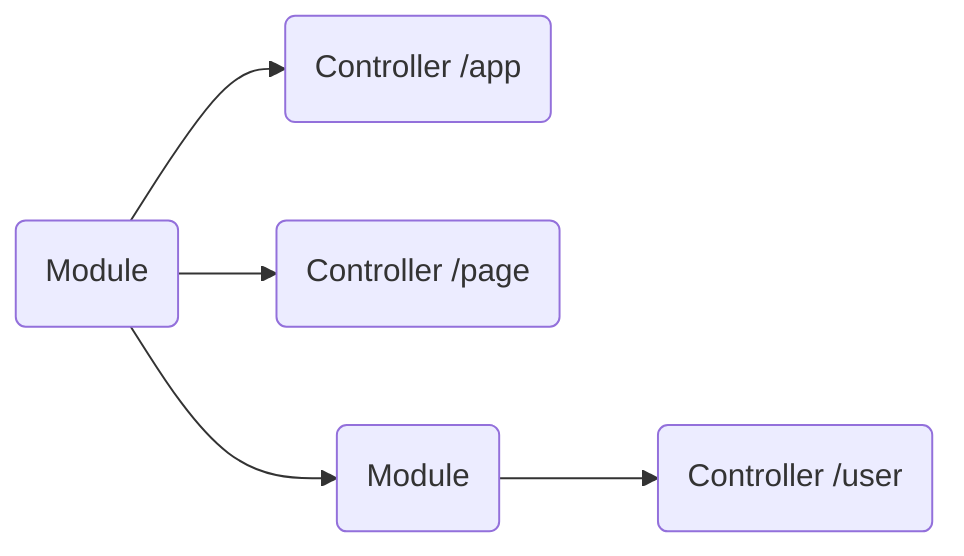

# Modules

The modules are classes with the necessary metadata in order to define the structure of the application.
They can import other modules and define its controller.
An application must have at least one root module (a module importing all the other modules).



The Modules are decorated with the `@Module()` decorator that is necessary to define its metadata (other modules or controllers).
```typescript
@Module({
  modules: [RandomModule],
  controllers: [TestController],
  providers: [
    HttpService,
    ExternalTestService,
    TestRootService
  ]
})
export class TestRootModule { }
```
