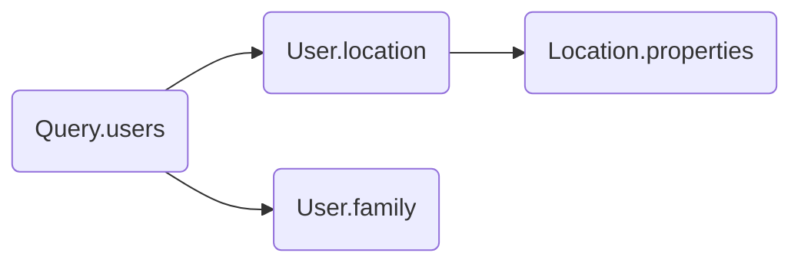

# Fields

The fields that a query shall resolve are represented by class methods decorated with the `@Field()` decorator.

## Options

The `@Field()` decorator supports the options declared inside the `IFieldOptions` interface.

| Options  | Description                                                                                                  | Required |
|----------|--------------------------------------------------------------------------------------------------------------|----------|
| `name`   | The name of the field in the SDL schema. If not specified, than the name is assumed to be the method's name. | No       |
| `type`   | The belonging SDL schema type of the field.                                                                  | Yes      |

```graphql
type Query {
  users: [User]
}

type User {
  id: ID
  name: String
  surname: String
  location: Location
  family: Family
}

type Family {
  father: String!
  mother: String!
  userId: ID!
}

type LocationProperties {
  locationId: ID!
  property: String!
}

type Location {
  id: ID!
  city: String!
  country: String!
  properties: [LocationProperties!]!
}
```

```typescript
import { Resolver, Query, Field, Parent } from '@pequehq/graphql';
import { Injectable } from '@pequehq/di';
import {
  UserService,
  FamilyService,
  LocationService,
  LocationPropertyService
} from '../your/services';
import { User, Location, LocationProperty, Family } from '../your/dto'

@Injectable()
@Resolver()
class ResolverSchemaOne {
  constructor(private userService: UserService,
              private familyService: FamilyService,
              private locationService: LocationService,
              private locationPropertyService: LocationPropertyService) {}
  
  @Query()
  async users(): Promise<User[]> {
    return await this.userService().getAll();
  }

  @Field({ type: User })
  async location(@Parent() parent: User): Promise<Location> {
    return await this.locationService.get(parent.location);
  }

  @Field({ type: User })
  async family(@Parent() parent: User): Promise<Family> {
    return await this.familyService.get(parent.family);
  }

  @Field({ type: Location, name: 'properties' })
  async properties(@Parent() parent: Location): Promise<LocationProperty[]> {
    return await this.locationPropertyService.get(parent.id);
  }
}
```

## Graph representation
The above resolve class is indeed representing the resolver graph that will be executed in order to resolve data for
a specified query.


