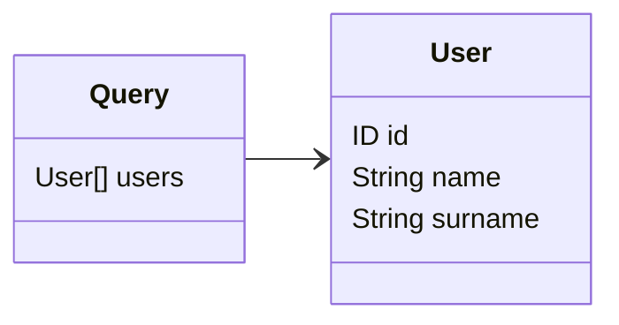

# Queries

Queries are the entry point of a GraphQL operation. Resolvers will resolve one query at a time, and the `@Query()`
decorator shall decorate the class method that contains the query resolver logic.

## Options

The `@Query()` decorator supports the options declared inside the `IQueryOptions` interface.

| Options  | Description                                                                                                             | Required |
|----------|-------------------------------------------------------------------------------------------------------------------------|----------|
| `name`   | The name of the query in the SDL schema query type. If not specified, than the name is assumed to be the method's name. | No       |



```typescript
import { Resolver, Mutation } from '@pequehq/graphql';
import { Injectable } from '@pequehq/di';
import { UserService } from '../your/services';
import { User } from '../your/dto'

@Resolver()
class ResolverSchemaOne {
  constructor(private userService: UserService) {}

  @Query()
  async users(): Promise<User[]> {
    return await this.userService().getAll();
  }
}
```
