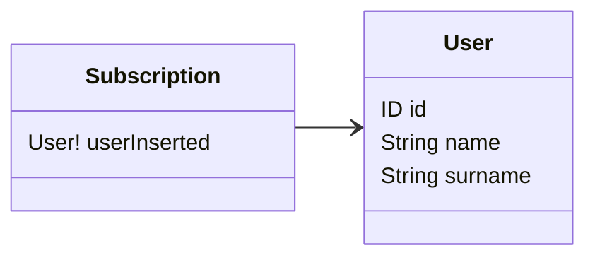

# Subscriptions

Subscriptions are fields which uses a different paradigm to resolve compared to queries. Instead of getting a one time 
result, the subscription will ask to the server to subscribe to real-time data (like streaming), and the client will
receive data as soon as new datasets are pushed by the service set by the subscription resolver.

Inside the resolver, the subscriptions are class methods decorated by the `@Subscription()` decorator.


## Options

The `@Subscription()` decorator supports the options declared inside the `ISubscriptionOptions` interface.

| Options  | Description                                                                                                                           | Required |
|----------|---------------------------------------------------------------------------------------------------------------------------------------|----------|
| `name`   | The name of the subscription in the SDL schema subscription type. If not specified, than the name is assumed to be the method's name. | No       |



```typescript
import { Resolver, Mutation } from '@pequehq/graphql';
import { Injectable } from '@pequehq/di';
import { UserService, PubSubService } from '../your/services';
import { User } from '../your/dto'

@Injectable()
@Resolver()
class ResolverSchemaOne {
  constructor(private userService: UserService,
              private pubSub: PubSubService) {}

  @Subscription()
  userInserted(): User {
    return this.pubSub.asyncIterator('userInserted');
  }
}
```

## Pub Sub

The `PubSub` pattern is well explained in Apollo [documentation](https://www.apollographql.com/docs/graphql-subscriptions/setup/).

Please, also read carefully that the basic `PubSub` implementation provided in the lib [`graphql-subscriptions`](https://github.com/apollographql/graphql-subscriptions)
is not suitable for production environments because it only supports a single server (in-memory), and it should to be
replaced by one of the available `PubSub` subclasses.
Read more [here](https://www.apollographql.com/docs/apollo-server/data/subscriptions/#the-pubsub-class). 
